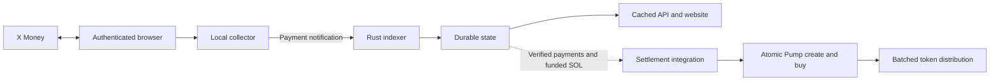

# XLaunch

A Rust token presale launchpad connecting X Money contributions to token creation
and distribution on Solana through Pump.

X Money activity comes from an operator-controlled browser instance. Requests
run through the authenticated browser session, and a local collector posts the
sender, amount and memo to our indexer. This browser relay is our integration
approach for the rate limiting and automated-access restrictions encountered
with direct polling. Browser credentials stay with the collector; the indexer
receives normalized payment notifications.



The browser collector is deployed separately. This repository provides its
receiver contract, the launchpad, the settlement library, and an optional CDP
recorder for inspecting an authorized browser session. It does not ship private
X Money routes, browser sessions, or a general-purpose HTTP proxy.

## What is implemented

- A file-backed indexer with exact decimal amounts, ordered receipts, atomic
  writes, and restart recovery.
- A cached Rust API and website for raises, contributions, progress, token
  images, and social links. Explore is a separate page with curve market caps
  for raises and cached Jupiter valuations for graduated tokens.
- Pinata image and metadata uploads, with a compact three-line launch memo.
- A $12,000 raise target and one-hour deadline. The creation fee is currently
  $1 for testing, separate from the raise; `/api/config` reports current terms.
- An isolated settlement library for atomic Pump creation and a native SOL buy,
  followed by transfers weighted by contribution arrival order.
- Airdrop packing by actual transaction size and simulation, receipt checks,
  and a durable submission journal using the official Helius Sender SDK. The
  same signed transaction is submitted concurrently to all seven Sender regions.
  Settlement uses 500,000 CU and 2,800 micro-lamports/CU (1,400 lamports priority fee).

The receiver and web application do not yet invoke automatic mainnet settlement.
The host integration must supply verified settled payments, currency conversion
and SOL funding, signers, and a processed transaction receipt feed. The dollar
notification ledger, micro-USDC allocation ledger, and lamport budget are
separate amounts. See [settlement](docs/rust-settlement.md) for the boundaries.

## Run locally

The backend targets Unix and Rust edition 2024. Use a recent Rust toolchain
supporting `std::fs::File::try_lock` (verified with Rust 1.97.1).
Pinata credentials are required by the web application. Market data uses a
processed Solana RPC and optional `JUPITER_API_KEY`; see [market data](docs/market-data.md). The frontend assets
are included; Node is only needed for browser tests.

```sh
cp .env.example .env
chmod 600 .env
# Fill in your private configuration, including both bind addresses.
set -a
. ./.env
set +a
cargo build --locked --bins
```

Start the indexer first:

```sh
target/debug/capture_ingest "$INDEXER_BIND_ADDRESS" "$INDEXER_DATA_DIR"
```

In another shell with the same environment loaded, start the website:

```sh
target/debug/launchpad "$WEB_BIND_ADDRESS" \
  "$INDEXER_DATA_DIR/state.json" "$LAUNCHPAD_DATA_DIR" \
  frontend frontend-api frontend-vendor
```

Both commands take their listening addresses from your environment. The binaries
do not load `.env` automatically. Example systemd units in `tools/` use an
operator-provided environment file and an example installation directory.

## Browser → indexer contract

The collector posts to `/transactions` with `Content-Type: application/json`:

```json
{
  "sender": "@alice",
  "amount": "25.50",
  "memo": "TOKEN_MINT RECIPIENT_SOLANA_WALLET"
}
```

Amounts are positive dollars with at most two decimal places. A successful
`{"ok":true}` response means the notification was saved. This is our internal
format, not an X Money API schema. Credentials and browser request headers are
not part of it. The current receiver has no authentication middleware or
upstream transfer-ID deduplication; provide network access control and deduplication
in the deployment/collector. See the [receiver contract](docs/capture-ingest.md)
and [browser relay](docs/browser-capture.md).

## Launch and contribute

On the deploy page, enter a name, symbol, image and optional socials. Pinata
stores one metadata document containing the image and social links. Copy config
produces the launch memo:

```text
Name: Example Coin
Symbol: EXAMPLE
Metadata Uri: ipfs://METADATA_CID
```

Send the creation fee with that memo. Once indexed, the raise exposes its reserved
mint address. Contribution memos contain that mint and the recipient's
Solana wallet, separated by whitespace, in either order. Exactly one address
must identify a token in the catalog; ambiguous memos remain unallocated. The image URI and metadata URI are distinct; the metadata URI is
the one used for eventual on-chain creation.

## Verification

```sh
cargo fmt --check
cargo test --locked
cargo clippy --all-targets --locked -- -D warnings
python3 tools/verify_snapshot.py
python3 tools/test_ingest_recovery.py
```

The ordinary Rust suite is offline; the signed Surfpool test is opt-in.
[Testing instructions](docs/surfpool-e2e.md) cover the mainnet fork and real
Pinata/browser E2E. Test output goes under ignored `var/`, not into the public
source tree. Public Pump IDLs and historical account snapshots remain as
[regression fixtures](docs/verification.md), not live pricing or configuration.

## Project layout

| Path | Purpose |
| --- | --- |
| `src/bin/capture_ingest.rs` | Browser notification receiver |
| `src/web/` | Durable catalog, metadata and cached API |
| `src/{presale,scheduler,settlement}.rs` | Ordered raises and settlement lifecycle |
| `src/{launch,transaction,sender}.rs` | Construction, signing and delivery |
| `src/{allocation,distribution,receipt}.rs` | Weights, batches and reconciliation |
| `frontend/`, `frontend-api/`, `frontend-vendor/` | Templates, live logic and runtime assets |
| `tests/`, `tools/` | Regression tests and verification runners |

Secrets belong in private environment files. Browser captures, signing keys,
payment state, images, logs, and generated reports are excluded by `.gitignore`.
Keep durable runtime state backed up outside Git. See
[API documentation](docs/web-backend.md) and
[third-party notices](THIRD_PARTY_NOTICES.md).
